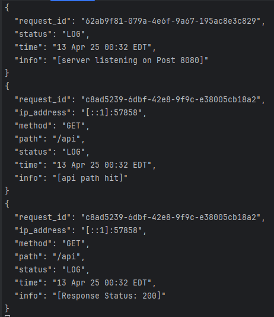
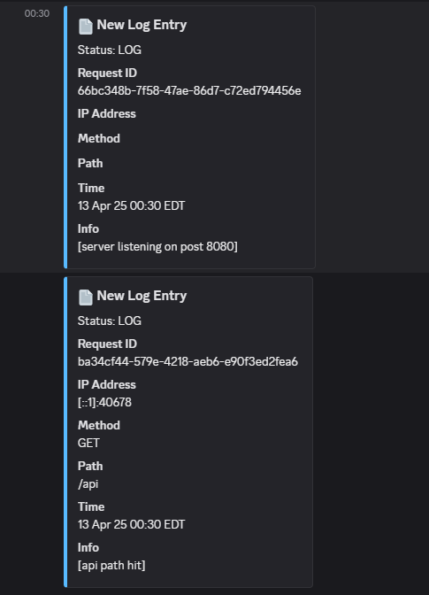

# Go 1.24.x Utility Project

A reusable Go module with common utilities I frequently use across projects.

1. 🔧 Structured logging:
   1. Optional HTTP middleware for request logging.
   2. Built-in Discord integration for real-time alerts
2. 🧠 In-memory caching:
   1. Lightweight, thread-safe, using sync.Map package.
3. Error:

## Installation

```code
go get github.com/iTchTheRightSpot/utility
```

### Log terminal view



### Discord log view

